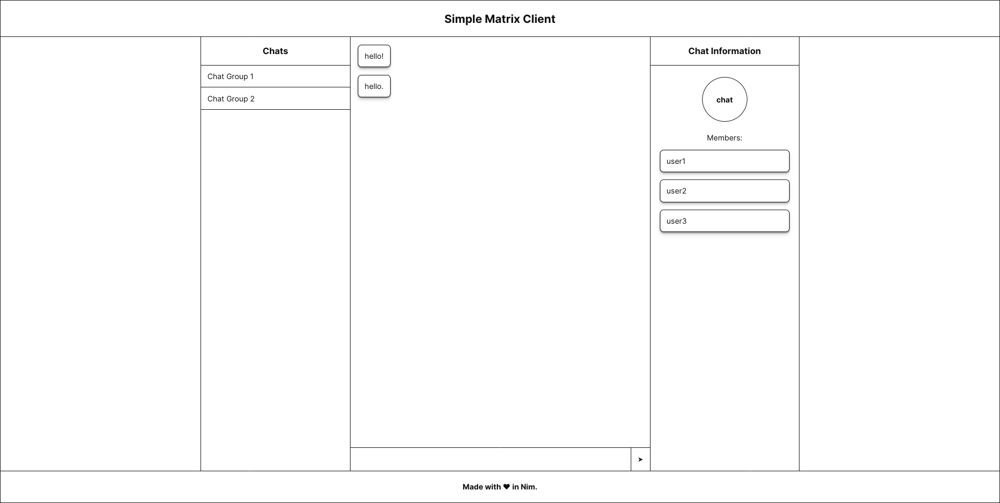

# simple-matrix-client

A simple matrix web client implemented using [matrix-nim-sdk](https://github.com/dylhack/matrix-nim-sdk/).

Features:
 - Stores previously signed-in accounts in IndexedDB
 - Guest registration with display name

TODO:
 - [x] Indicate what chat is currently selected
 - [x] Send messages
 - [x] Store login token in IndexedDB
 - [x] Long-polling for Sync API
 - [ ] Setup a data store for sync and chat data
 - [ ] Get chat name for chat list
 - [ ] Display message for encrypted chats
 - [ ] Properly name DMs in chat information pane
 - [ ] Make it faster on large accounts
 - [ ] Make the UI more mobile friendly
 - [ ] Add logout button
 - [ ] Add exit button for messages and chat info panes